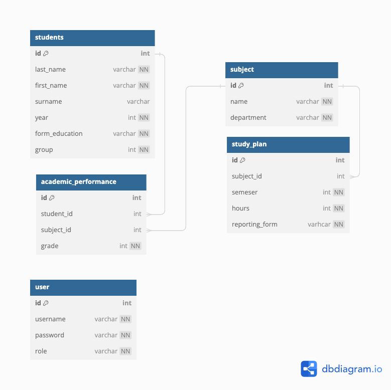

# Dean's Office

CLI application providing interaction in dialogue mode for the dean's office.

## Tech Stack

- Java 17
- Spring Framework (Boot, Shell, Data JDBC, Data JPA)
- PostgreSQL
- Liquibase
- Docker

## Features

- Get a certificate of academic performance to student
- Create and Read operation for each entity
- Get count the number of students in for form of study
- Get the number of hours and reporting forms for discipline

## Environment Variables

To run this project, you will need to add the following environment variables to your .env file

- `HOST` - host of Postgresql database
- `DB_USERNAME` - username for Postgresql database
- `DB_PASSWORD` - password for Postgresql database
- `DB_NAME` - name of Postgresql database

## Database

